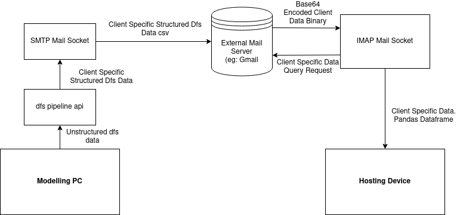

Introduction to the DFS Mail Socket API
=======================================

Data from the DFS Hydrodynamic (HD) Models is output in custom file formats as well as in a structured file directory.
The `DFS data pipeline library <placeholder>` provides APIs for building a scheduled pipeline that transforms DFS data into
more traditional formats and loads said data into some upstream process such as a web server.

For large quantities of model data other forms of data transfer are used, such as TCP sockets. However, until a web API is built
that allows transformed model data to be pulled from the HD model server a method of reliably transferring small quantities of data.

The Mail Socket API serves that function. It wraps logic around the SMTP and IMAP Client objects that allows a web server (primarily gmail)
to serve as a means of data transfer for small, easily base64 encoded data.

Below is an Example of how the Mail Socket is used in a data pipeline:

In summary the Mail API Encodes data into base64 and sends said data as an attachment to a mail server (again gmail) using the SMTP protocol.
The email is sent with a "Subject" used for identification, which is compiled based on the users input parameters.

The file_name parameter is used to build the email Subject string that is parsed on the other end by the IMAP data query api. The subject of the
email is built as follows:
 ::
 
  {file_name};{file_name};forecast;{datetime_sent}

This Subject string is what is used on the IMAP end of the Mail API to query data from the mail server.

Example of using the SMTP Mail API to send model data:

.. code-block:: python

 # Creating an SMTP Socket Object:
 ruby_wave_smtp_mail_socket = smtp_socket(smtp_server, port, mail_address, psswrd)

 # Sending Data to the SMTP mail server:
 ruby_wave_smtp_mail_socket.send_forecast_data("C:\\example_path_to_csv_file.csv", 'filename')

And An Example of using the IMAP Mail API to extract data sent to the mail server:

.. code-block:: python

 # Declaring an IMAP Socket Object:
 ruby_wave_api = imap_socket(imap_server, mail_address, psswrd)

 # Extracting the data from the mail server as a pandas dataframe:
 ruby_wave_data = ruby_wave_api.get_forecast_data('filename')

That was an example of using the Mail API to extract csv/timeseries data. If
additional functionality is needed (such as other data structures needed to be sent), additional methods should be added/used.
